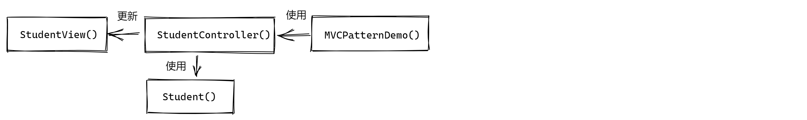

# MVC模式
Model-View-Controller(模型-视图-控制器)
- Model: 模型代表一个存取数据的对象
- View: 模型包含的数据的可视化
- Controller: 作用于模型和视图之上。控制数据流向模型对象，在数据变化时更新视图。使视图和模型分离。
- Demo
    - 创建Students模型类
    - 创建StudentView视图类，把学生的详细信息输入到控制台
    - 创建StudentController控制器类，存储数据到Student对象中，相应的更新视图StudentView
      
    

    # 创建Student类， 一个Model类
    class Student:
        _rollno = ""
        _name = ""
    
        def get_rollno(self):
            return self._rollno
    
        def set_rollno(self, rollno):
            self._rollno = rollno
    
        def get_name(self):
            return self._name
    
        def set_name(self, name):
            self._name = name
    
    
    # 创建视图StudentView
    class StudentView:
        def print_student_detail(self, name, rollno):
            print("Student:")
            print("Name: {}".format(name))
            print("Rollno: {}".format(rollno))
    
    
    # 创建控制器
    class StudentController:
        def __init__(self, Model, View):
            self._model = Model
            self._view = View
    
        def set_studnt_name(self, name):
            self._model.set_name(name)
    
        def set_studnt_rollno(self, rollno):
            self._model.set_rollno(rollno)
    
        def get_studnt_rollno(self):
            return self._model.get_rollno()
    
        def update_view(self):
            self._view.print_student_detail(self._model.get_name(), self._model.get_rollno)
    
    
    # 调用输出
    if __name__ == "__main__":
    
        def retrieve_studnt_from_db():
            student = Student()
            student.set_name("Ethan")
            student.set_rollno("1010")
            return student
    
        model = retrieve_studnt_from_db()
        view = StudentView()
        controller = StudentController(model, view)
        controller.update_view()

  
