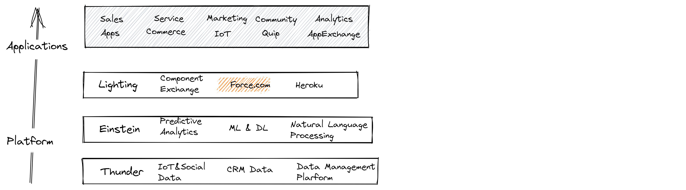

# Salesforce Basis
- CRM (Customer-relationship management)  
- CRM是用户数据及用户联系的可信数据集合
- Salesforce开发
- Salesforce企业软件，Saas(软件即服务)，软件在云端
- History of CRM  

  
## 为什么使用CRM？
- Salesforce中的术语
  - contacts 现有公司内的个人联系人
  - leads 可能成为目标客户的个人联系人
  - accounts 公司们
  - opportunities 一个打交道的公司
- 记录联系人的信息 
- 了解销售线索，进展
- 与邮件连接，自动记录相关信息
- 销售人员分组，寻找最佳销售
- 行业、公司规模分组，寻找销售对象
- SOQL语句查询，自动生成报告
## 为什么是Salesforce？
- 每一个生意都是不同的，标准化的模式达不到要求
- Salesforce具有灵活性，可自定义数据模型和视图
- Salesforce不仅是CRM，更像是创建CRM应用的平台
- History of Salesforce  

## Salesforce开发是什么
- 开发时需要服务器（存储程序供外部访问），程序，编译解释器（将代码转换为机器识别的语言），数据库（供程序存储查询数据）。Salesforce继承了后台数据库，服务器，Force.com平台提供程序编写入口，与提供客户常用的功能。
- 多租户：它允许企业或者个人申请Salesforce org环境，只需要一个用户名和密码就可以针对自己的org进行个性化定制使用。  

## Force.com
Force.com 是 Salesforce 整体架构的核心模块；因为它首先整合和控制了底层的物理的基础设施（网络、内存、数据库等），接着给上层的Sales Cloud，Service Cloud，Chatter和基于Force.com的定制应用提供PaaS服务，最后，那些Force.com上层的应用以SaaS形式供用户使用。作为Salesforce开发人员，是在基于Force.com的平台上定制开发应用，可以理解为Force.com是Salesforce向开发人员开放的程序接口。    

