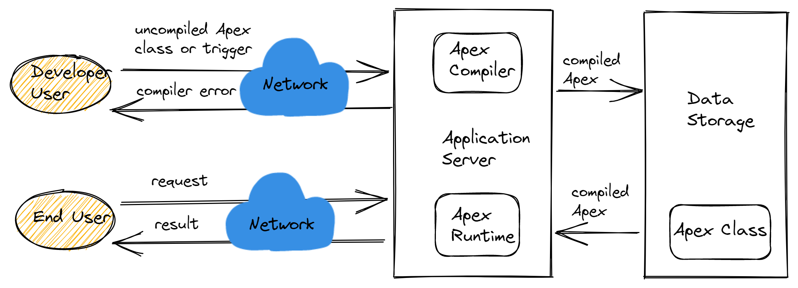
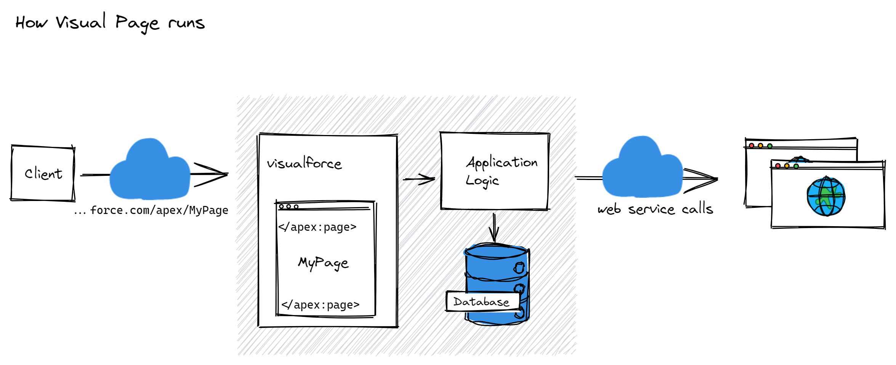

# Salesforce Basis--Dev
- Salesforce开发的核心任务是使组织可以将Salesforce扩展到声明式点击配置之外，构建应用程序，进而优化业务运营。  
- 初级开发人员：0~2年经验。根据特定要求编写代码（例如，基础的Apex Triggers）；测试。  
- 初级开发人员需要帮助不断改进和增强组织的Salesforce平台。任务可能包括：
  - 根据特定要求编写代码，例如：
    - 基础的Apex Triggers（更新字段）
    - 基础的Visualforce页面 
  - 测试 
  - 学习开发的最佳实践
- 想要成为Salesforce开发，需要具备Web开发/Java经验，以及掌握Apex，Apex是Salesforce的基础。如果你了解Java，应该能更快地掌握Apex。将此与Javascript 结合使用，在探索Salesforce开发框架LWC方面会有优势  

## Apex & Visualforce
- Apex是一种强类型的，面向对象的编程语言，开发人员通过Apex表现业务逻辑来补充Salesforce平台所需的功能。  
- http://Salesforce.com提供了多种预打包的解决方案，例如针对特定目的设计的Sales＆Service Cloud。而http://Force.com允许您构建自己的应用程序。
- Visualforce是http://Force.com平台上以组件为单位的用户界面框架。  
- 该框架包含基于标记的标记语言, 和HTML类似。每个Visualforce标签对应于一个用户界面组件，例如页面的一部分或字段。Visualforce拥有约100个内置组件以及一种机制，开发人员可以使用该机制创建自己的组件。
- Lightning 组件是一个UI框架，主要用于移动和桌面设备开发动态Web应用程序该框架连接了客户端和服务器的分区多层组件开发。在客户端使用JavaScript，在服务器端使用Apex。

## Salesforce生态圈
- Salesforce ------ 一个平台
- 需求方在Salesforce上简单的定制，实现自己的业务需求。
- 第三方开发者基于Salesforce平台，为客人提供标准服务，或者定制服务。
- 以上三者造就了Salesforce的生态圈。

## 提交代码到Salesforce，服务器端发生了什么

- 开发人员编码后(不管实在Salesforce的Console或者实在本地的IDE)，需要及时提交代码由Application Server 进行审查代码是否正确：
  - 如果是基本语法错误，比如数据类型不对，变量命名重复等，IDE会及时检查并提醒报错
  - 如果因为表名，字段名称不存在等需要服务器端验证，则如空指针等，属于运行时错误。
- 在将代码存储在数据库中之前，必须保证代码能够通过服务器验证，否则代码保存失败。 
- 数据库只能存一份编译后的代码，因此在提交代码前，先同步服务器端最新版本的代码，然后再提交自己的代码

## Apex
Apex的语言是为Force.com量身定做的一门语法上类似Java的强类型面向对象语言，
主要可以通过Apex在Force.com上创建Web Service，编辑复杂的商业逻辑和整合多个Force.com的模块等，Apex主要以两种方式执行：
- 以单独脚本的形式 , 按照用户的需要执行
- 以页面访问或者触发器的形式 , 当一个特定的数据处理事件发生的之前或者之后 , 与这个事件绑定的Apex代码将会被执行

### 数据类型
Apex语言数据类型包括三类：
- 基本数据类型： 整型(integer)，浮点型(double, float)，字符串(string)，ID(数据记录的在Salesforce数据库中的唯一标识)，布尔型(boolean)，日期/日期时间(date\datetime)
- 集合类：链表(list)，集合(Set)，映射(map)
- 对象类型： object包括用户自定义的类，对象，Sobject(salesforce object)

### 语法特点

### 开发工具
Salesforce自带的控制台工具，还可以使用VSCode、Eclipse、Sublime等工具进行Salesfoce开发

### Visual Page
Visual Page类似于普通Web Page，包含的内容不限于HTML、CSS、JS等资源。我们写的Visualforce Page存储在服务器端，当用户通过url访问的时候，会被渲染成普通的Web Page,供需求用户访问
- Page的运行原理
  
- Page的组成部分：基本的前端元素是不可少的（HTML、CSS、JS），Salesforce还提供了预制的标准组件供开发人员使用，然后当用户访问的时候，这些组件会被解释为基本的前端元素  
- Page Controller: Visualforce Page开发是传统的MVC模式，页面通过与绑定的Controller进行数据、方法交互，系统内所有的标准对象与自定义对象都有一个标准的Controler，标准的Controller包含基本的保存、删除等方法，在开发过程中，如果你不仅仅需要标准Controler中的方法，更多的时候需要一些自定义的方法，那么可以通过继承标准类来添加个性化的方法  
- Page的controller方法： 页面的元素无非可以分为三类：显示数据、输入数据、执行操作，那么映射到Controller中分别对应：Gettter方法、Setter方法、Action方法
  - Getter方法会返回一个数值给到Page页面
  - Setter方法允许用户在页面填写的表单信息赋值Controller中的变量中  
  - 
- Page 表达式： Visualforce Page可以显示从数据库、Web Service等源检索出的数据，这些动态的数据可以通过页面标签加载出来，分为全局变量、计算表达式以及页面属性等，统称为Viualforce 表达式  
- Page 常用全局变量：常用的全局变量包含：Action（Salesforce标准动作，比如跳转对象主页、创建、编辑、删除记录等）、Label、Profile、User（当前登陆用户信息等）

